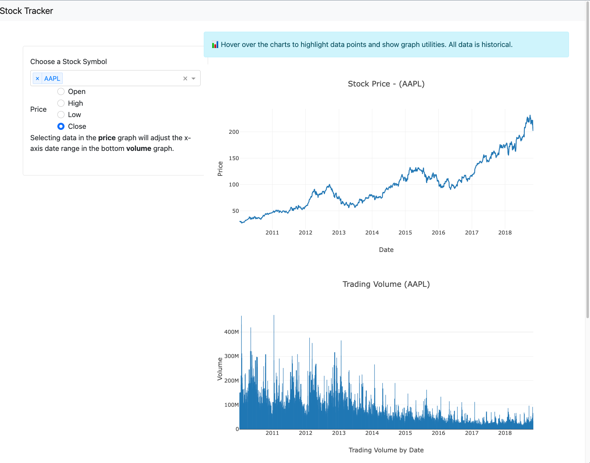

# Stock Pricing Dashboard

## About this example

A Dash application makes it easy to transform your analysis into an interactive dashboard using Python so users can ask and answer questions in real-time, without having to touch any code.

